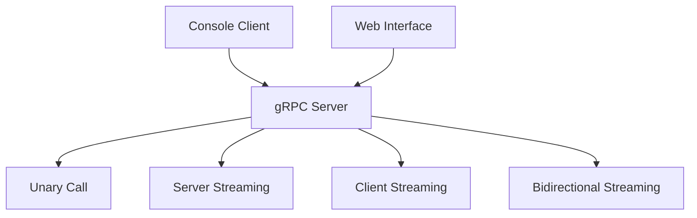

# 🚀 gRPC Demo - Understanding gRPC Flows

This .NET project demonstrates all types of gRPC communication flows with practical examples and real-time visualization interface.

## 📋 Table of Contents

- [🎯 Objective](#-objective)
- [🏗️ Architecture](#️-architecture)
- [🔧 Installation](#-installation)
- [🚀 Quick Start](#-quick-start)
- [📚 gRPC Flow Types](#-grpc-flow-types)
- [💻 Usage](#-usage)
- [🌐 Web Interface](#-web-interface)
- [📊 Logs and Monitoring](#-logs-and-monitoring)
- [🔍 Troubleshooting](#-troubleshooting)

## 🎯 Objective

This project aims to:
- **Visually explain** different types of gRPC flows
- **Demonstrate** each pattern with concrete examples
- **Enable interactive learning** of gRPC concepts
- **Visualize** real-time communications

## 🏗️ Architecture

The project consists of 7 applications:

```
GrpcDemo/
├── GrpcServer/              # gRPC server with all patterns
├── GrpcClient/              # Interactive console client
├── GrpcWebUI/               # Web visualization interface
├── GrpcClientChat/          # Bidirectional chat client
├── GrpcClientMonitor/       # Real-time monitoring client
├── GrpcClientStressTest/    # Performance testing client
├── GrpcChatServer/          # Dedicated chat hub server
├── GrpcClientChatHub/       # Chat hub client
└── README.md                # This documentation
```

### Flow Structure



## 🔧 Installation

### Prerequisites

- .NET 8.0 SDK
- Visual Studio 2022 or VS Code
- Modern web browser

### Installation Steps

1. **Clone the project**
```bash
git clone <repository-url>
cd GrpcDemo
```

2. **Restore NuGet packages**
```bash
dotnet restore
```

3. **Build the project**
```bash
dotnet build
```

## 🚀 Quick Start

### 1. Start the Server

```bash
cd GrpcServer
dotnet run
```

The server will be available at: `https://localhost:5001`

### 2. Start the Console Client

```bash
cd GrpcClient
dotnet run
```

### 3. Start the Web Interface

```bash
cd GrpcWebUI
dotnet run
```

The web interface will be available at: `https://localhost:5002`

### 4. Organized Startup Scripts

The project now offers specialized scripts for different types of demonstrations:

#### Main Script (Interactive Menu)
```bash
.\start-demo.ps1
```

#### Basic gRPC Flows
```bash
# Start servers for basic flows
.\start-basic-flows.ps1

# Start test clients
.\start-basic-clients.ps1
```

#### Multi-Client Chat
```bash
# Start chat server
.\start-chat-services.ps1

# Start multiple chat clients
.\start-chat-clients.ps1
```

## 📚 gRPC Flow Types

### 1. 📞 Unary Call
**Pattern:** One call, one response

```csharp
// Client
var response = await client.UnaryCallAsync(request);

// Server
public override async Task<UnaryResponse> UnaryCall(UnaryRequest request, ServerCallContext context)
```

**Use cases:** REST-like APIs, authentication, simple queries

### 2. 📡 Server Streaming
**Pattern:** One call, multiple responses

```csharp
// Client
using var call = client.ServerStreaming(request);
await foreach (var response in call.ResponseStream.ReadAllAsync())

// Server
public override async Task ServerStreaming(StreamingRequest request, IServerStreamWriter<StreamingResponse> responseStream, ServerCallContext context)
```

**Use cases:** Real-time notifications, file downloads, data streaming

### 3. 📤 Client Streaming
**Pattern:** Multiple calls, one response

```csharp
// Client
using var call = client.ClientStreaming();
await call.RequestStream.WriteAsync(request);
await call.RequestStream.CompleteAsync();
var response = await call;

// Server
public override async Task<StreamingResponse> ClientStreaming(IAsyncStreamReader<StreamingRequest> requestStream, ServerCallContext context)
```

**Use cases:** File uploads, data collection, batch processing

### 4. 🔄 Bidirectional Streaming
**Pattern:** Multiple calls, multiple responses

```csharp
// Client
using var call = client.BidirectionalStreaming();
await call.RequestStream.WriteAsync(request);
await foreach (var response in call.ResponseStream.ReadAllAsync())

// Server
public override async Task BidirectionalStreaming(IAsyncStreamReader<StreamingRequest> requestStream, IServerStreamWriter<StreamingResponse> responseStream, ServerCallContext context)
```

**Use cases:** Real-time chat, multiplayer games, collaboration

## 💻 Usage

### Console Client

The console client offers an interactive menu:

```
🎯 MAIN MENU - gRPC Flow Types
=============================
1. 📞 Unary Call (One call, one response)
2. 📡 Server Streaming (One call, multiple responses)
3. 📤 Client Streaming (Multiple calls, one response)
4. 🔄 Bidirectional Streaming (Multiple calls, multiple responses)
5. ℹ️  Server Information
6. 🎨 Complete Demonstration
0. ❌ Exit
```

### Usage Examples

#### Test Unary Call
```bash
# In the console client
Your choice: 1
Enter your message: Hello gRPC!
```

#### Test Server Streaming
```bash
# In the console client
Your choice: 2
Enter your message: Streaming test
# The server will send 5 messages with a 1-second delay
```

## 🌐 Web Interface

The web interface (`https://localhost:5002`) offers:

- **Real-time visualization** of gRPC flows
- **Intuitive graphical interface**
- **Colored logs** for each type of communication
- **Explanatory diagrams** of flows
- **Interactive tests** for each pattern

### Features

- ✅ Tests for all flow types
- ✅ Real-time colored logs
- ✅ Visual flow diagrams
- ✅ Responsive interface
- ✅ Error handling

## 📊 Logs and Monitoring

### Server Logs

The server displays detailed logs:

```
🔵 UNARY CALL received: Hello gRPC! (Client ID: 1234)
🟢 UNARY RESPONSE sent: Hello Hello gRPC! ! Processed by server. (Time: 105ms)
```

### Log Types

- 🔵 **Incoming requests** (Blue)
- 🟢 **Outgoing responses** (Green)
- ❌ **Errors** (Red)
- ℹ️ **Information** (Yellow)

### Connection Monitoring

```bash
# Server information
curl https://localhost:5001/info
```

## 🔍 Troubleshooting

### Common Issues

#### 1. SSL Certificate Error
```bash
# Solution: Accept self-signed certificates
# The code already handles this automatically
```

#### 2. Port already in use
```bash
# Change ports in Program.cs
app.Run("https://localhost:5003");  # Instead of 5001
```

#### 3. Connection error
```bash
# Check that the server is started
curl https://localhost:5001
# Should return: "gRPC Demo Server - Ready to receive calls!"
```

### Debug Logs

To enable detailed logs:

```csharp
// In Program.cs
builder.Logging.SetMinimumLevel(LogLevel.Debug);
```

## 🎓 Concepts Learned

After using this project, you will understand:

1. **The 4 types of gRPC flows** and their use cases
2. **The difference** between each pattern
3. **Implementation** on server and client sides
4. **Stream management** and connections
5. **Monitoring** and debugging of gRPC flows
6. **Best practices** for each type of flow

## 🚀 Next Steps

- Add gRPC authentication
- Implement compression
- Add custom metadata
- Test with clients in other languages
- Implement gRPC interception

## 📝 License

This project is provided for educational purposes. Free to use and modify.

---

**🎉 Congratulations!** You now master gRPC flows! 

For any questions, consult the detailed logs or test with the interactive web interface.
